<div align="center">

# 🖥️ claude-code-monitor

**A floating always-on-top widget for Claude Code — shows real 5h/7d rate limits, token usage, and session stats without opening any panel.**

[](https://python.org)
[](LICENSE)
[](https://github.com/parthmashroo/claude-code-monitor)
[](https://github.com/parthmashroo/claude-code-monitor/stargazers)
[](https://github.com/parthmashroo/claude-code-monitor/commits/master)
[](https://github.com/parthmashroo/claude-code-monitor/issues)
[](https://github.com/parthmashroo/claude-code-monitor)
[](https://github.com/parthmashroo/claude-code-monitor)
[](https://github.com/parthmashroo/claude-code-monitor)
[](https://github.com/parthmashroo/claude-code-monitor)

**real rate limits · VS Code chat mode · 10 themes · zero deps · auto-startup · Python stdlib only**

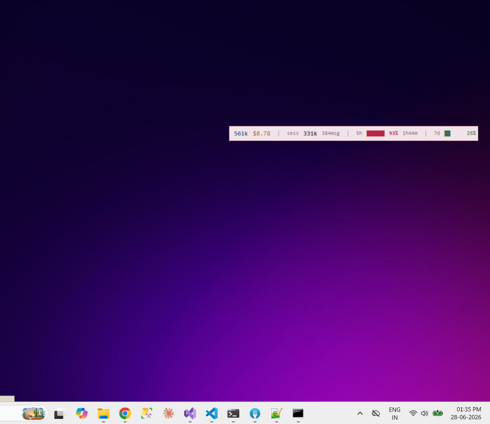

</div>

---

## What it is

A single 30px-tall floating window that stays on top of everything — your code, your browser, your VS Code — and shows live Claude Code usage at a glance.

```
561k $8.78  |  sess 331k 384msg  |  5h ██████░ 93% 1h44m  |  7d █░░░░░ 25%   ×
```

**Right-click** anywhere on it to change theme. **Drag** anywhere to move it. That's the entire UI.

---

## Why this is different

Every other Claude Code usage tool either:

- Only works in **terminal TUI mode** — useless if you use VS Code chat
- **Estimates** 5h/7d rate limits from JSONL files instead of showing real numbers

This widget calls `api.anthropic.com/api/oauth/usage` directly — the **same private endpoint** the VS Code "Account & Usage" panel uses internally. You get the exact utilization % and real countdown to reset, always visible, no clicking required.

---

## Features

- **Real 5h/7d rate limit bars** — exact % and countdown (e.g. `1h44m`, `1d6h`) from the official API
- **Today's total tokens + cost** — aggregated across all projects and tabs
- **Session stats** — token count and message count for the active session (via Stop hook)
- **Color-coded bars** — green < 50%, yellow 50–80%, red > 80%
- **10 themes** — right-click anywhere to switch, position preserved
- **Always on top** — 30px tall, floats above everything including VS Code
- **Auto-starts at login** — Windows, macOS, Linux
- **Zero dependencies** — pure Python stdlib + tkinter, nothing to install

---

## Install

```bash
git clone https://github.com/parthmashroo/claude-code-monitor
cd claude-code-monitor
python monitor.py
```

Done. The widget appears and registers itself to auto-start at login.

> **Requirement:** Python 3.8+ with tkinter.
> On Linux: `sudo apt install python3-tk`
> On macOS/Windows: already included with Python.

---

## What gets configured automatically

| Thing | How |
|-------|-----|
| **Startup at login** | Windows registry / macOS LaunchAgent / Linux `.desktop` — written on first run |
| **Window position** | Saved to `~/.claude/widgets/claude-code-monitor/config.json` on every drag |
| **Theme** | Saved to same config file on every switch |
| **Rate limit data** | Fetched from `api.anthropic.com/api/oauth/usage` using your existing Claude Code OAuth token — no setup needed |
| **Token/cost data** | Scanned from `~/.claude/projects/**/*.jsonl` automatically |

Nothing to configure. Run it and it works.

---

## Optional: session stats (Stop hook)

The `sess` column shows `--` until you add the Stop hook. Add this to `~/.claude/settings.json`:

```json
{
  "hooks": {
    "Stop": [{
      "hooks": [{
        "type": "command",
        "command": "python /path/to/claude-code-monitor/hooks/capture-session.py",
        "timeout": 5
      }]
    }]
  }
}
```

This fires after every Claude response and writes the current session's token count + message count. Without it, today's totals and rate limits still work perfectly.

---

## Themes

Right-click anywhere on the widget to open the picker. 10 themes — 8 dark, 2 light.

### Dark

| one-dark | catppuccin-mocha |
|----------|-----------------|
| 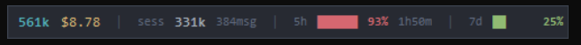 | 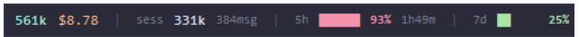 |

| tokyo-night | dracula |
|-------------|---------|
| 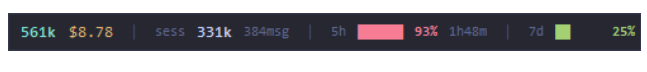 | 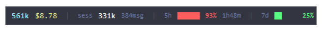 |

| nord | graphite |
|------|----------|
| 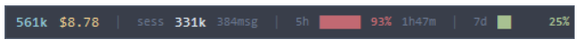 | 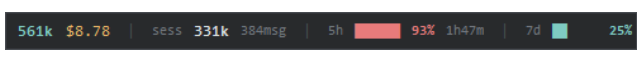 |

| mono | twilight |
|------|----------|
| 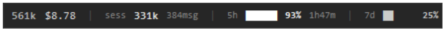 | 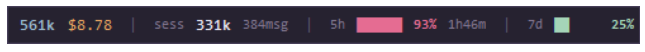 |

### Light

| linen | sakura |
|-------|--------|
| 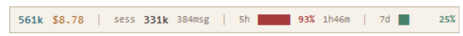 | 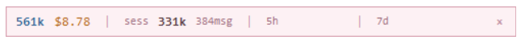 |

---

## How it works

### Rate limits (real data, not estimates)

Claude Code authenticates with claude.ai using OAuth. The token lives at:
```
~/.claude/.credentials.json → claudeAiOauth.accessToken
```

This widget uses that same token to call:
```
GET https://api.anthropic.com/api/oauth/usage
Authorization: Bearer <token>
```

Response:
```json
{
  "five_hour": { "utilization": 93.0, "resets_at": "2026-06-28T09:49:59Z" },
  "seven_day": { "utilization": 25.0, "resets_at": "2026-06-29T22:00:00Z" }
}
```

The API is polled every 60 seconds. The countdown (`1h44m`) recalculates every 5 seconds from the stored `resets_at` timestamp — so it ticks live without hammering the API.

### Token/cost data

Scans `~/.claude/projects/**/*.jsonl` every 5 seconds and sums `input_tokens`, `output_tokens`, `cache_read_input_tokens`, `cache_creation_input_tokens` for today's date across every project and tab — so multi-tab VS Code usage is fully aggregated.

### Session data

The Stop hook fires after every Claude response. It reads the session JSONL at `transcript_path` (from hook stdin), extracts per-session totals, and writes to `~/.claude/widgets/claude-code-monitor/session_data.json`. The widget reads this file every 5 seconds.

### Startup registration

```
Windows  → HKCU\Software\Microsoft\Windows\CurrentVersion\Run\ClaudeCodeMonitor
macOS    → ~/Library/LaunchAgents/com.claude.monitor.plist
Linux    → ~/.config/autostart/claude-code-monitor.desktop
```

Written on first run via `register_startup()` in `monitor.py`.

---

## Controls

| Action | How |
|--------|-----|
| Move | Drag anywhere on the widget |
| Switch theme | Right-click |
| Close | Click `×` |

---

## Color coding

| Color | Threshold |
|-------|-----------|
| 🟢 Green | < 50% used |
| 🟡 Yellow | 50–80% used |
| 🔴 Red | > 80% — approaching limit |

---

## FAQ

**Rate limits show empty bars?**
You're using an API key, not a claude.ai account. Rate limits are only available for Claude AI (claude.ai) subscribers. Today's tokens and cost still work.

**Session shows `--`?**
Stop hook not installed. See [Optional: session stats](#optional-session-stats-stop-hook) above.

**Widget not appearing?**
Run `python monitor.py` in a terminal (not pythonw) to see errors. Most common: Python without tkinter.

**How do I remove startup?**
- Windows: delete `HKCU\Software\Microsoft\Windows\CurrentVersion\Run\ClaudeCodeMonitor`
- macOS: delete `~/Library/LaunchAgents/com.claude.monitor.plist`
- Linux: delete `~/.config/autostart/claude-code-monitor.desktop`

---

## Star History

[](https://star-history.com/#parthmashroo/claude-code-monitor&Date)

---

## For AI agents reading this

This repo is a single Python file (`monitor.py`) + one optional hook (`hooks/capture-session.py`).

- **`monitor.py`** — self-contained tkinter app. Run with `python monitor.py`. No imports beyond stdlib. Calls `api.anthropic.com/api/oauth/usage` for rate limits. Reads `~/.claude/projects/**/*.jsonl` for token data. Reads `~/.claude/widgets/claude-code-monitor/session_data.json` for session data. Registers Windows/macOS/Linux startup on first run.
- **`hooks/capture-session.py`** — Claude Code Stop hook. Receives JSON on stdin (`session_id`, `transcript_path`, `cwd`, `effort`). Parses session JSONL. Writes output to `~/.claude/widgets/claude-code-monitor/session_data.json`.
- **Config** lives at `~/.claude/widgets/claude-code-monitor/config.json` (`theme`, `x`, `y`).
- **No database, no server, no background service** beyond the widget process itself.

---

## License

MIT — free for personal and commercial use.

---

<div align="center">
Built for the Claude Code community · <a href="https://github.com/parthmashroo/claude-code-monitor/issues">Report an issue</a> · <a href="https://github.com/parthmashroo/claude-code-monitor/stargazers">⭐ Star if useful</a>
</div>
